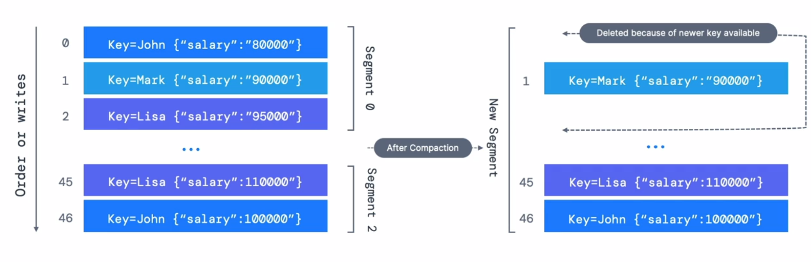
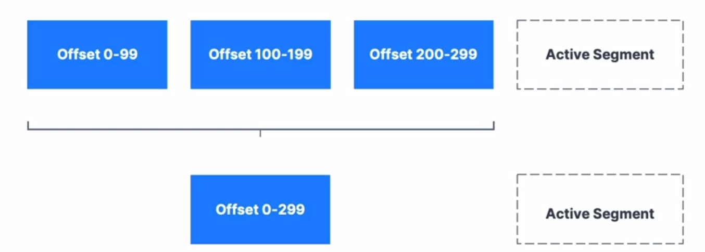

## Log cleanup policies

* Kafka clusters make data expire according to policy called<i><b> Log Cleanup Policy</b></i>
* <b>Policy1</b>: <br>
`log.cleanup.policy=delete` <br>
Kafka default for all user topics <br>
  - Delete based on age of data (default is 1 Week)
  - Delete based on max size of log (default is -1 == infinite)

* <b>Policy2</b>: <br>
`log.cleanup.policy=compact` <br>
Kafka default for topi `__consumer_offsets`
  - Delete based on keys of your message
  - Will delete old duplicate keys after the active segment is completed
  - Infinite time and space retention


<details>
  <summary>kafka-topics.sh --bootstrap-server localhost:9092 --describe __consumer_offsets</summary>
  
  ```sh
Topic: __consumer_offsets	TopicId: SpJiwDL-RWSBkRsy30R3iA	PartitionCount: 50	ReplicationFactor: 1	Configs: compression.type=producer,cleanup.policy=compact,segment.bytes=104857600
	Topic: __consumer_offsets	Partition: 0	Leader: 0	Replicas: 0	Isr: 0
	Topic: __consumer_offsets	Partition: 1	Leader: 0	Replicas: 0	Isr: 0
	Topic: __consumer_offsets	Partition: 2	Leader: 0	Replicas: 0	Isr: 0
	Topic: __consumer_offsets	Partition: 3	Leader: 0	Replicas: 0	Isr: 0
	Topic: __consumer_offsets	Partition: 4	Leader: 0	Replicas: 0	Isr: 0
	Topic: __consumer_offsets	Partition: 5	Leader: 0	Replicas: 0	Isr: 0
	Topic: __consumer_offsets	Partition: 6	Leader: 0	Replicas: 0	Isr: 0
	Topic: __consumer_offsets	Partition: 7	Leader: 0	Replicas: 0	Isr: 0
	Topic: __consumer_offsets	Partition: 8	Leader: 0	Replicas: 0	Isr: 0
	Topic: __consumer_offsets	Partition: 9	Leader: 0	Replicas: 0	Isr: 0
	Topic: __consumer_offsets	Partition: 10	Leader: 0	Replicas: 0	Isr: 0
	Topic: __consumer_offsets	Partition: 11	Leader: 0	Replicas: 0	Isr: 0
	Topic: __consumer_offsets	Partition: 12	Leader: 0	Replicas: 0	Isr: 0
	Topic: __consumer_offsets	Partition: 13	Leader: 0	Replicas: 0	Isr: 0
	Topic: __consumer_offsets	Partition: 14	Leader: 0	Replicas: 0	Isr: 0
	Topic: __consumer_offsets	Partition: 15	Leader: 0	Replicas: 0	Isr: 0
	Topic: __consumer_offsets	Partition: 16	Leader: 0	Replicas: 0	Isr: 0
	Topic: __consumer_offsets	Partition: 17	Leader: 0	Replicas: 0	Isr: 0
	Topic: __consumer_offsets	Partition: 18	Leader: 0	Replicas: 0	Isr: 0
	Topic: __consumer_offsets	Partition: 19	Leader: 0	Replicas: 0	Isr: 0
	Topic: __consumer_offsets	Partition: 20	Leader: 0	Replicas: 0	Isr: 0
	Topic: __consumer_offsets	Partition: 21	Leader: 0	Replicas: 0	Isr: 0
	Topic: __consumer_offsets	Partition: 22	Leader: 0	Replicas: 0	Isr: 0
	Topic: __consumer_offsets	Partition: 23	Leader: 0	Replicas: 0	Isr: 0
	Topic: __consumer_offsets	Partition: 24	Leader: 0	Replicas: 0	Isr: 0
	Topic: __consumer_offsets	Partition: 25	Leader: 0	Replicas: 0	Isr: 0
	Topic: __consumer_offsets	Partition: 26	Leader: 0	Replicas: 0	Isr: 0
	Topic: __consumer_offsets	Partition: 27	Leader: 0	Replicas: 0	Isr: 0
	Topic: __consumer_offsets	Partition: 28	Leader: 0	Replicas: 0	Isr: 0
	Topic: __consumer_offsets	Partition: 29	Leader: 0	Replicas: 0	Isr: 0
	Topic: __consumer_offsets	Partition: 30	Leader: 0	Replicas: 0	Isr: 0
	Topic: __consumer_offsets	Partition: 31	Leader: 0	Replicas: 0	Isr: 0
	Topic: __consumer_offsets	Partition: 32	Leader: 0	Replicas: 0	Isr: 0
	Topic: __consumer_offsets	Partition: 33	Leader: 0	Replicas: 0	Isr: 0
	Topic: __consumer_offsets	Partition: 34	Leader: 0	Replicas: 0	Isr: 0
	Topic: __consumer_offsets	Partition: 35	Leader: 0	Replicas: 0	Isr: 0
	Topic: __consumer_offsets	Partition: 36	Leader: 0	Replicas: 0	Isr: 0
	Topic: __consumer_offsets	Partition: 37	Leader: 0	Replicas: 0	Isr: 0
	Topic: __consumer_offsets	Partition: 38	Leader: 0	Replicas: 0	Isr: 0
	Topic: __consumer_offsets	Partition: 39	Leader: 0	Replicas: 0	Isr: 0
	Topic: __consumer_offsets	Partition: 40	Leader: 0	Replicas: 0	Isr: 0
	Topic: __consumer_offsets	Partition: 41	Leader: 0	Replicas: 0	Isr: 0
	Topic: __consumer_offsets	Partition: 42	Leader: 0	Replicas: 0	Isr: 0
	Topic: __consumer_offsets	Partition: 43	Leader: 0	Replicas: 0	Isr: 0
	Topic: __consumer_offsets	Partition: 44	Leader: 0	Replicas: 0	Isr: 0
	Topic: __consumer_offsets	Partition: 45	Leader: 0	Replicas: 0	Isr: 0
	Topic: __consumer_offsets	Partition: 46	Leader: 0	Replicas: 0	Isr: 0
	Topic: __consumer_offsets	Partition: 47	Leader: 0	Replicas: 0	Isr: 0
	Topic: __consumer_offsets	Partition: 48	Leader: 0	Replicas: 0	Isr: 0
	Topic: __consumer_offsets	Partition: 49	Leader: 0	Replicas: 0	Isr: 0
```
</details>

<br>

- The cleaner checks for work every 15 ms. <br>
`log.cleaner.backoff.ms`

### Log Cleanup policy : Delete (default)

- `log.retention.hours`
  - Number of hours to keep data for (default is 168 i.e. 1 week)
  - Higher number means more disk space
  - Lower number means less data is retained
  - Other parameters
  <br>
  `log.retention.ms` <br>
  `log.retention.minutes`  <br>


- `log.retention.bytes`
  - Max size in bytes for each partition (default is -1: infinite)
  - Size should be kept under threshold.

### Log Cleanup policy : Compact
- Log Compaction ensures that your log conatins at least the last known value for a specific key within a partition.

- `topic: employee-salary`
<br>
We want to keep most recent salary for our employee.
<br>



Log compaction does not deletes offsets, it just deletes keys when there are newer keys available in the topics.

- Any consumer that is reading the topic from the tail of the log(most current data) will still see all the messages sent to the topic.
- Ordering of messages is kept, log compaction removes some messages and does not reorders them.
- Offsets of messages are immutable, they are skipped if the messages is missing.
- Deleted records can still be seen by the consumers for a grace period of delete.retention.ms (default is 24 hours)


### Log Compaction : How does it work?
<br>



* Log compaction `log.cleanup.policy=compact` is impacted by:
  * `segment.ms` (default 7 days): Max amount of time to close the active segment.
  * `segment.bytes` (default 1G) : Max size of segment
  * `min.compaction.lag.ms` (default 0) : how long to wait befoe the message can be compacted.
  * `delete.retention.ms` (default 24 hours) : wait before deleting data marked for compaction.
  * `min.cleanable.dirty.ratio` (default 0.5) : higher &rarr; less and more efficient cleaning, lower &rarr; more and less efficient cleaning.

### Experiment on log compaction

* Create a topic `employee-salary` with log compaction with following command:

```sh
kafka-topics.sh --bootstrap-server localhost:9092 --create --topic employee-salary \
 --partitions 1 \
 --replication-factor 1 \
 --config cleanup.policy=compact \
 --config min.cleanable.dirty.ratio=0.001 \  # log compaction triggered very quickly
 --config segment.ms=5000 
```

```sh
kafka-topics.sh --bootstrap-server localhost:9092 --topic employee-salary --describe
Topic: employee-salary	TopicId: YwOoQh-2R7W1VlrHiOMqsg	PartitionCount: 1	ReplicationFactor: 1	Configs: cleanup.policy=compact,segment.bytes=1073741824,min.cleanable.dirty.ratio=0.001
	Topic: employee-salary	Partition: 0	Leader: 0	Replicas: 0	Isr: 0
```

* Create a consumer
```sh
kafka-console-consumer.sh --bootstrap-server localhost:9092 \
	--topic employee-salary \
	--from-beginning \
	--property print.key=true \
	--property key.separator=,
```

* Create a producer
```sh
kafka-console-producer.sh --bootstrap-server localhost:9092 \
	--topic employee-salary \
	--property parse.key=true \
	--property key.separator=,
```

* Producer following messages:
```
Patrick,salary: 10000
Lucy,salary: 20000
Bob,salary: 20000
Patrick,salary: 25000
Lucy,salary: 30000
Patrick,salary: 30000
```

* Close the consumer and start again &rarr; consumes messages after log compaction
```
Patrick,salary: 25
Lucy,salary: 50000
Bob,salary: 20000
Stephane,salary: 0
```