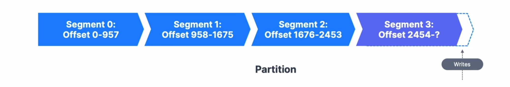
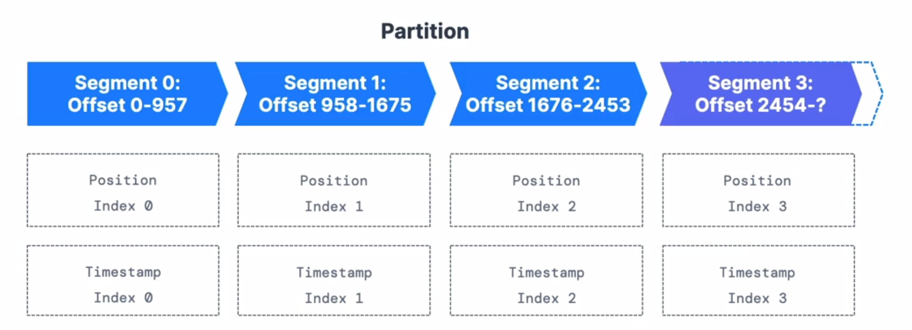

## Segment and Indexes

* Topics are made up of partitions
* Partitions are made of segments(files)

* Only one segment is active (the one data is written to)
* Two segment settings:
  * log.segment.bytes: The max size of single segment in a byte(default 1GB)
  * log.segment.ms: the time kafka will wait before commiting a segment if not full (1 week)
* Segments come with two indexes(files):
  * An offset to position index: helps kafka find where to read from and find a message.
  * A timestamp to offset index: helps kafka find messages with a specific timestamp.

* A smaller log.segment.bytes (size, default: 1GB) means:
  * More segments per partition
  * Log compaction happens more often
  * Kafka has to keep more files open (Error: Too many open files
> How fast will I have new segments based on througput

* A smaller log.segment.ms (time, default 1 week) means:
  * You set a maximum frequency for log compaction (more frequent triggers)
  * Maybe you want daily compaction or weekly
> How often do I need log compaction to happen
